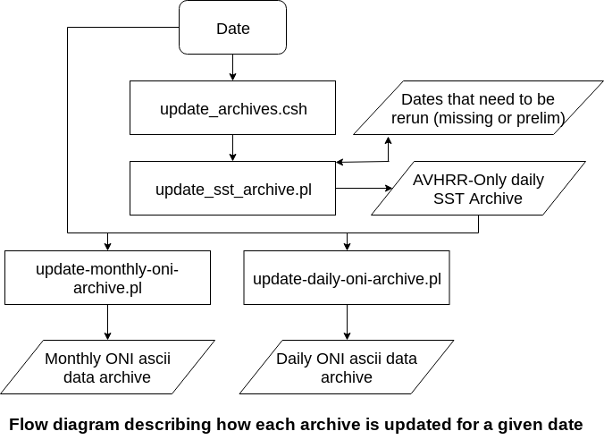

# realtime-oni

README
===============

- *App Owner: [Adam Allgood](mailto:adam.allgood@noaa.gov)*  
- *CPC Operational Backup: [Daniel Harnos](mailto:daniel.harnos@noaa.gov)*

Table of Contents
-----------------

- [Overview](#overview)
- [Other Documents](#other-documents)
- [NOAA Disclaimer](#noaa-disclaimer)
- [Global Variables Used](#global-variables-used)
- [Input Data](#input-data)
- [Output Data](#output-data)
- [Process Flow](#process-flow)
- [NOAA Disclaimer](#noaa-disclaimer)

Overview
---------------

This application downloads and archives daily real-time AVHRR-only gridded SST data created by the National Centers for Environmental Prediction (NCEI) and calculates the Oceanic Niño Index (ONI). The ONI is defined as a running mean of SST anomalies in the Niño 3.4 region (5°N-5°S, 120°-170°W). The standard time window for computing the ONI is three calendar months, updated monthly (the monthly ONI); however, a daily updating running mean using the previous 90 days is also calculated (the daily ONI).

This application is not intended to replace the ERSST.v5-based ONI published on the CPC Web Page ([here](http://www.cpc.ncep.noaa.gov/products/analysis_monitoring/ensostuff/ONI_v5.php)). The planned usage is a rapidly updating (daily) index that serves as input into statistical prediction tools for subseasonal to seasonal time scales. 

Other Documents
---------------

- [How to Install](docs/HOW-TO-INSTALL.md)
- [How to Run](docs/HOW-TO-RUN.md)
- [Contributing Guidelines](docs/CONTRIBUTING.md)
- [Software License](LICENSE)

Global Variables Used
---------------

- `$REALTIME_ONI` The app location
- `NCO_COM_DATA` The operational NCO dataflow mount
- `DATA_IN` Root path to expected location of input data (e.g., the SST archive)
- `DATA_OUT` Root path to output location

Input Data
---------------

### AVHRR-Only SST Data

**Location:** https://www.ncei.noaa.gov/data/sea-surface-temperature-optimum-interpolation/access/avhrr-only

Files are named `/{yyyy}{mm}/avhrr-only-v2.{yyyy}{mm}{dd}.nc`, where `{yyyy}` is the integer calendar year, `{mm}` is the 2-digit integer month number (01, 02, ..., 12), and `{dd}` is the 2-digit integer day of the month.

For recent data (1-2 weeks old), a preliminary version may be all that is available. The naming convention for these files is `/{yyyy}{mm}/avhrr-only-v2.{yyyy}{mm}{dd}_preliminary.nc`. The software attempts to download a preliminary file if the final data are not available.

Since realtime-oni is designed primarily to run within CPC operations, the archiving script first attempts to find these data on a mount provided by NCEP Central Operations (NCO) dataflow (`$NCO_COM_DATA/observations/satellite/netcdf/avhrr`). If the data are not there or the mount does not exist, the software will then attempt to obtain the data from the NCEI server above using wget. Because of this, realtime-oni can be installed and run outside of CPC if you wish, but an environment variable `NCO_COM_DATA` is expected to be defined. If you are attempting to use this application outside of CPC operations, this variable can be set to a dummy value.

**Format:** [NetCDF](https://www.unidata.ucar.edu/software/netcdf/docs/netcdf_introduction.html) daily gridded data

Output Data
---------------

### Local AVHRR-Only SST Data Archive

**Location:** `$DATA_OUT/observations/ocean/short_range/global/sst-avhrr/daily-data`

Files are named `/{yyyy}/avhrr-only-v2.{yyyy}.{mm}.{dd}.nc`, and are simply copies of the [input data](#input-data) arranged in a local archive with a GrADS [data descriptor file](http://cola.gmu.edu/grads/gadoc/SDFdescriptorfile.html) that allows [templating](http://cola.gmu.edu/grads/gadoc/templates.html) over the daily data. To set up the data descriptor file and archive on your system, see the [How to Install](docs/HOW-TO-INSTALL.md) documentation.

**Script that creates these data:** `$REALTIME_ONI/scripts/update-sst-archive.pl`

### Daily ONI Archive

**Location:** `$DATA_OUT/observations/ocean/long_range/global/oni-avhrr`

These plain-text ascii files are named `{yyyy}/oni-90day-ending-{yyyy}{mm}{dd}.txt` and have the following structure:

`90-days-ending-{yyyy}{mm}{dd}   {SST}   {ONI}`

The `{SST}` value is the average sea surface temperature over the Niño 3.4 region during the 90-day period. The `{ONI}` value is the departure of `{SST}` from the climatological value.

**Script that creates these data:** `$REALTIME_ONI/scripts/update-daily-oni-archive.pl`

See [How to Run](docs/HOW-TO-RUN.md) for more information about this script.

### Monthly ONI Archive

**Location:** `$DATA_OUT/observations/ocean/long_range/global/oni-avhrr`

These plain-text ascii files are named `{yyyy}/oni-{MMM}.txt`, where `{yyyy}` is the year of the final month in the period, and `{MMM}` is a 3-character season identifier using the first letter of each month name in the 3-month season (e.g., JFM for January through March). The files have the following structure:

`{MMM} {yyyy}   {SST}   {ONI}`

The `{SST}` value is the average sea surface temperature over the Niño 3.4 region during the 90-day period. The `{ONI}` value is the departure of `{SST}` from the climatological value.

**Script that creates these data:** `$REALTIME_ONI/scripts/update-monthly-oni-archive.pl`

See [How to Run](docs/HOW-TO-RUN.md) for more information about this script.

Process Flow
---------------

NOAA Disclaimer
===============

This repository is a scientific product and is not official communication of the National Oceanic and Atmospheric Administration, or the United States Department of Commerce. All NOAA GitHub project code is provided on an ‘as is’ basis and the user assumes responsibility for its use. Any claims against the Department of Commerce or Department of Commerce bureaus stemming from the use of this GitHub project will be governed by all applicable Federal law. Any reference to specific commercial products, processes, or services by service mark, trademark, manufacturer, or otherwise, does not constitute or imply their endorsement, recommendation or favoring by the Department of Commerce. The Department of Commerce seal and logo, or the seal and logo of a DOC bureau, shall not be used in any manner to imply endorsement of any commercial product or activity by DOC or the United States Government.
